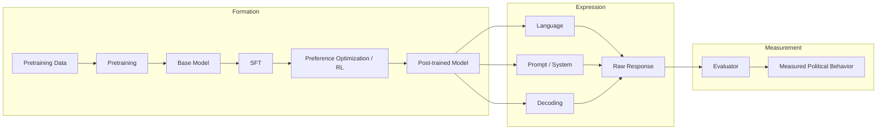
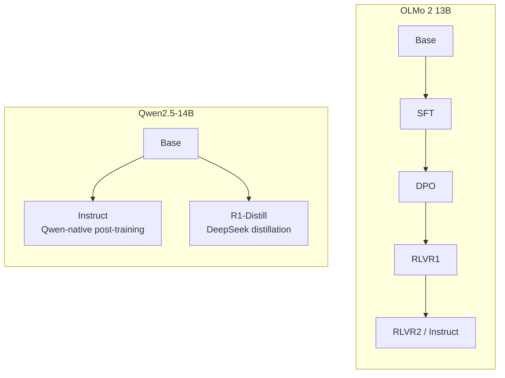

# anatomiae

**Decomposing the sources of political behavior in language models**

[](https://github.com/VectorSophie/anatomiae/actions/workflows/ci.yml)
[](https://www.python.org/downloads/release/python-3120/)
[](LICENSE)

`anatomiae` is a reproducible research framework for studying where measured
political behavior in language models emerges — across pretraining data,
model-development stage, post-training, inference conditions, language, and
evaluation methodology.



## Overview

A model producing politically-coded output is not the same claim as a model
holding a political identity. Between a prompt and a reported "bias score"
sit a long chain of human choices — what went into pretraining, how the
model was aligned, which language and prompt were used, and which
instrument scored the response. `anatomiae` treats each link in that chain
as a variable to be measured, not assumed.

## Research questions

- **Emergence** — at what stage of model development does measurable
  political behavior emerge?
- **Attribution** — how much observed variation is associated with (or,
  where a controlled intervention permits it, attributable to) corpus
  composition, pretraining, architecture, SFT, preference optimization,
  language, inference conditions, or evaluator choice?
- **Stability** — which tendencies survive paraphrase, proposition
  inversion, language change, system prompts, decoding changes, and
  evaluator changes?
- **Measurement dependence** — how much of a reported result changes when
  identical cached model outputs are scored by a different instrument?

## Why pipeline-level decomposition?

Comparing two unrelated models ("Model X scores more left-leaning than
Model Y") is nearly uninterpretable: they typically differ in pretraining
corpus, architecture, scale, and post-training all at once. `anatomiae`
prioritizes **model lineages** — checkpoints that share a foundation and
differ in one controlled way — so a measured difference can actually be
attributed to something. See [`docs/model_lineages.md`](docs/model_lineages.md).

Generation and scoring are structurally separated: a response is generated
once and cached immutably, then scored by multiple independent evaluators.
No evaluator can influence generation, and adding an evaluator never
triggers regeneration. See [`docs/architecture.md`](docs/architecture.md).

## Current status

| Component | Status |
|---|---|
| Repository infrastructure, GPU isolation guard | Complete |
| Transformers backend | Complete (real generation verified) |
| vLLM backend | Complete (real generation verified; see `docs/reproducibility.md` for a machine-specific workaround) |
| Locked-paper audit (5/5 papers) | Complete — `docs/PRIOR_WORK_MATRIX.md` |
| Model/dataset identity verification | Complete — `docs/MODEL_AUDIT.md`, `docs/DATASET_AUDIT.md` |
| Bilingual/multilingual provenance schema | Complete |
| OLMo 2 13B lineage download (Base→SFT→DPO→RLVR2) | In progress (Base done, SFT in progress) |
| Prompt constructor / evaluator pipeline | Not started |
| Faulborn reproduction | Not started |
| Backend-equivalence study | Not started (single-pair smoke comparison only) |
| ≥3 model lineages end-to-end | Not started |
| Full pilot | Not started |

No fabricated progress here — an item is only marked complete once a real
artifact backs it (see `artifacts/logs/`, `docs/RESEARCH_AUDIT.md`).

## Installation

```bash
git clone https://github.com/VectorSophie/anatomiae.git
cd anatomiae
uv sync --extra dev
uv run pytest
```

This installs only the lightweight `dev` extra — no torch, no vLLM, no
CUDA — and is what CI runs on every push. For GPU workloads:

```bash
uv sync --extra dev --extra ml
```

See [`docs/reproducibility.md`](docs/reproducibility.md) for GPU setup,
the maintainers' machine-specific vLLM workaround, and measured download
bandwidth.

## Models

Full audit in [`docs/model_lineages.md`](docs/model_lineages.md) and
[`docs/MODEL_AUDIT.md`](docs/MODEL_AUDIT.md).

| Family | Core role | Transparency |
|---|---|---|
| OLMo 2 13B | Post-training lineage decomposition (Base→SFT→DPO→RLVR) | Full — open data, training code, full checkpoint chain |
| Amber | Pretraining trajectory (360 checkpoints) | Full — open data, checkpoint-level |
| Qwen2.5-14B → DeepSeek-R1-Distill-Qwen-14B | Parent/child post-training intervention | Partial — open weights only |
| Qwen3-14B | Modern open-weight family, multilingual behavior | Partial — open weights only |
| Llama 3.1 8B / Gemma 3 12B | External-validity controls | Low — open weights only, gated |



## Datasets

Full audit in [`docs/datasets.md`](docs/datasets.md) and
[`docs/DATASET_AUDIT.md`](docs/DATASET_AUDIT.md).

| Dataset | Scientific role |
|---|---|
| Faulborn et al. | Theory-grounded measurement methodology |
| Lim & Röttger | EN/ZH prompt-language and model-origin robustness |
| OpinionQA | Human-population grounding (Pew survey distributions) |
| Amber training sequence / DataDecide | Checkpoint- and recipe-level pretraining attribution |

## Reproducing the pilot

The end-to-end pilot is not yet complete (see status table above). Once
the validation gates in `docs/PILOT_PROTOCOL.md` pass, this section will
list exact commands to reproduce it from a fresh clone.

## Results

No pilot results yet — nothing here is fabricated or placeholder. Once
real experiments run, this section will link to `docs/results/pilot.md`
and embed a small curated set of real figures/tables.

## Repository structure

```text
src/anatomiae/       # pipeline code (see docs/architecture.md)
configs/models/       # model registry entries (one YAML per checkpoint)
docs/                   # audits, decisions, architecture, results
figures/                 # Mermaid diagram sources + generated exports
artifacts/                # manifests, logs, generated tables (small ones versioned)
scripts/                    # standalone smoke tests, download tooling
tests/                        # unit + integration tests
```

## Reproducibility

See [`docs/reproducibility.md`](docs/reproducibility.md) for GPU setup,
determinism notes, and measured download bandwidth.

## Known limitations

- Cross-family model comparisons (e.g. OLMo vs. Qwen) remain
  associational, not causal — they differ on more than one axis at once.
  Only within-lineage comparisons (e.g. OLMo Base→SFT→DPO→RLVR) support
  stronger attribution claims.
- The Lim & Röttger bilingual dataset's EN/ZH pairs are human-translated
  from a single-language source, not independently authored in both
  languages — every item carries explicit translation provenance so this
  is never silently treated as parallel-native data.
- Older political-bias benchmarks may already appear in some models'
  training data; contamination has not yet been audited for the full
  pilot set.
- Evaluator choice is itself a variable this project studies, not a fixed
  oracle — no single evaluator (including an LLM judge) is treated as
  ground truth.
- Some control-family models (Llama 3.1, Gemma 3) require a gated-license
  acceptance not yet completed; the locked model anchors do not depend on
  this.

## Citation

Citation information will be added with the first public manuscript. In
the meantime, see [`CITATIONS.bib`](CITATIONS.bib) for the prior work this
project builds on.

## License

Code is licensed under [Apache 2.0](LICENSE). Datasets and model weights
referenced by this project retain their own original licenses — see
[`docs/datasets.md`](docs/datasets.md) and
[`docs/MODEL_AUDIT.md`](docs/MODEL_AUDIT.md) for per-source terms.
