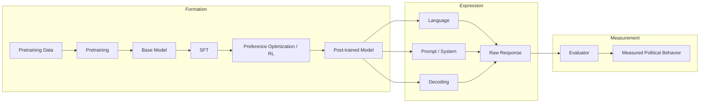
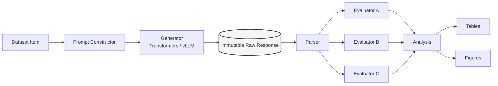

# Architecture

## Research decomposition: Formation → Expression → Measurement



Source: `figures/source/research_framework.mmd`.

Every claim this project makes about "where political behavior comes
from" is scoped to one of these three groups. A finding that evaluator
choice (Measurement) changes the apparent result is just as valid and
reportable as a finding that pretraining-stage (Formation) does — see
`docs/STATISTICAL_METHOD_AUDIT.md` for how percentages/contributions are
allowed to be phrased.

## Pipeline separation (non-negotiable)



Source: `figures/source/experiment_flow.mmd`.

Generation happens exactly once per `(model, prompt, decoding-config)`
triple; the raw response is written once and never overwritten. Every
evaluator reads the same immutable raw response — no evaluator can
influence what was generated, and re-running a new evaluator never
triggers regeneration. This is enforced structurally (see
`src/anatomiae/datasets/schema.py`, `docs/FRAMEWORK_DECISION.md`), not
just by convention.

## Module layout

```text
src/anatomiae/
├── cli/            # entry points (uv run anatomiae ...)
├── datasets/        # canonical item schema, dataset adapters
├── models/           # model registry (configs/models/*.yaml)
├── prompts/          # prompt construction, perturbations
├── inference/         # Transformers / vLLM backends
├── evaluators/        # scoring, one module per evaluator
├── metrics/            # outcome taxonomy, agreement statistics
├── analysis/            # raw records -> analysis frames -> tables
├── provenance/            # GPU isolation guard, generation-record schema
└── utils/
```

See `docs/FRAMEWORK_DECISION.md` for why this is a small bespoke package
rather than a fork of lm-evaluation-harness, Inspect AI, or HELM (patterns
from all three are borrowed; none is the foundation).

## GPU isolation

All GPU work on the maintainers' workstation is restricted to one
physical device, enforced by `src/anatomiae/provenance/gpu_guard.py`
before any CUDA context is created. This is a maintainer safety rule for
a specific shared machine, not a portability requirement — external
reproducers configure `CUDA_VISIBLE_DEVICES` for their own hardware. See
`docs/reproducibility.md`.
