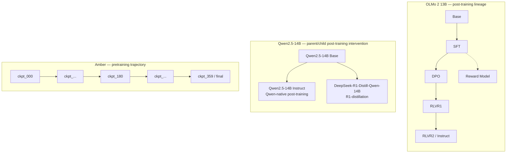

# Model lineages

## Model panel

Full audit detail (exact checkpoint IDs, license/gating status, disk
size, quirks) lives in `docs/MODEL_AUDIT.md`; this is the condensed
scientific-role summary.

| Family | Core role | Transparency | Status |
|---|---|---|---|
| OLMo 2 13B | Post-training lineage decomposition (Base→SFT→DPO→RLVR) | Full — open data (Dolma), open training code, full checkpoint chain | Locked anchor. Download in progress. |
| Amber | Pretraining trajectory (360 checkpoints) | Full — open data (`IFM/AmberDatasets`), checkpoint-level | Locked anchor. Pilot subset selection pending. |
| Qwen2.5-14B → DeepSeek-R1-Distill-Qwen-14B | Parent/child post-training intervention (Qwen-native vs. R1-distillation) | Partial — open weights, training data/code not public | Locked anchor. Download queued. |
| Qwen3-14B (Base + post-trained) | Modern Chinese-developed open-weight family, multilingual behavior | Partial — open weights only | Important, replaceable if a scientifically superior same-family checkpoint emerges. Download queued. |
| Llama 3.1 8B (Base + Instruct) | External-validity control, opaque-training baseline | Low — open weights only, gated | Blocked on license acceptance (`docs/HUMAN_ACTION_REQUIRED.md`). |
| Gemma 3 12B (PT + IT) | External-validity control, opaque-training baseline | Low — open weights only, gated | Blocked on license acceptance (`docs/HUMAN_ACTION_REQUIRED.md`). |

`anatomiae` prioritizes model *lineages* — related checkpoints that share
an architecture and differ in one controlled way — over an unrelated
leaderboard of models. A lineage gives leverage on *why* two models differ;
an unrelated pair only gives an unexplained difference.

Source: `figures/source/model_lineages.mmd`.

## OLMo 2 13B — within-lineage post-training decomposition

`allenai/OLMo-2-1124-13B` exposes a full public chain: Base → SFT → DPO →
RLVR1 → RLVR2/Instruct, plus the reward model. This is the primary
evidence for whether, and at which stage, measured political behavior
shifts within a *single* architecture and pretraining corpus — isolating
post-training effects from the confounds that plague cross-family
comparisons. See `docs/MODEL_AUDIT.md` for exact checkpoint IDs and
verification detail.

## Qwen2.5-14B → DeepSeek-R1-Distill-Qwen-14B — parent/child post-training intervention

Two different post-training regimes (`Qwen2.5-14B-Instruct`'s own RLHF
pipeline vs. `DeepSeek-R1-Distill-Qwen-14B`'s R1-distillation) applied to
the *same* `Qwen2.5-14B` base model. This isolates a post-training-method
effect while holding the pretrained foundation fixed.

## Amber — pretraining trajectory

`IFM/Amber` (the LLM360 project; the HF org renamed `LLM360` → `IFM`, see
`docs/MODEL_AUDIT.md`) publishes 360 intermediate checkpoints as git
branches (`ckpt_000` … `ckpt_359`). This is the only locked anchor that
gives checkpoint-level granularity *within* pretraining itself, letting
`anatomiae` ask when — not just whether — measured political behavior
emerges during pretraining.

## Why lineages over leaderboards

A finding like "Model X scores more left-leaning than Model Y" is nearly
uninterpretable on its own: X and Y typically differ in pretraining
corpus, architecture, scale, and post-training simultaneously. A finding
like "OLMo-2-13B's measured behavior shifts by Δ between DPO and RLVR2,
holding everything else fixed" is a real, attributable, within-lineage
effect. Cross-family comparisons (OLMo vs. Qwen vs. Amber) remain
reported, but are explicitly labeled associational, not causal — see
`docs/STATISTICAL_METHOD_AUDIT.md`.
